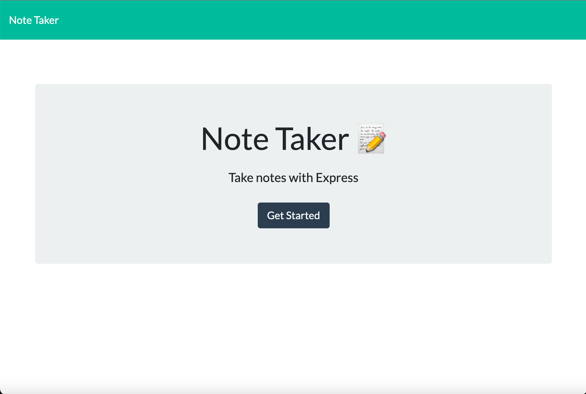

# Note-Taker-App

## Description
This note taker app lets you write and save notes. The app utilizes Express.js to store and retrieve notes from a db.json file! Finding the ways to connect the routes was very interesting and how they integrate together!

## Images


## Table of Contents
* [Installation](#installation)
* [Licenses](#licenses)
* [Deployed](#deployed)
* [Questions](#questions)

## Installation
To install use 
```js
npm install
``` 
To run on local you will need to use
```js
node server.js
```
## Licenses
This project falls under the following license(s): 
none
## Deployed
Deployed URL: [Note-Taker-App](https://young-woodland-54564.herokuapp.com/)
## Questions
If you have any questions, please contact me below: 

Github: [Cesar-Infante](https://github.com/Cesar-Infante)

Email: Cesar261110@gmail.com